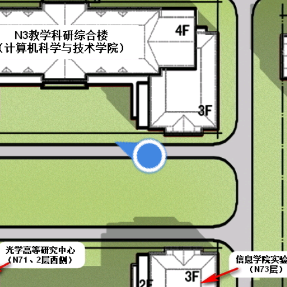

# SduMap
*山东大学青岛校区 地图APP*

又是一年新生入学时，徘徊在陌生的校园，你还因为不熟悉环境而在相似的教学楼前团团打转吗？已经成为学长学姐，却还是因为天生路痴属性一次次迷失在必经之路上吗？不用担心，这个APP来帮你！

我想随便说一下做这个APP的初衷：

刚进入这么大的校园，就算有路标，就算手里拿着纸质地图，但也很容易迷路，不知道自己在哪，甚至不知道东西南北，我就是这样。。而现有的手机地图APP又有没有精确的校区地图，于是就想着搞一个APP把地图、定位、指南针结合起来，也就是这个APP。虽然并没有多复杂，但对我来说有它会方便很多，不管是找宿舍、教室还是图书馆，或者是熟悉那群长的一样的楼，这个APP都帮了很大的忙，我也想让更多的人看到。

个人感觉地图这种东西留在手机里备用也没有什么坏处，万一以后用到了呢，是吧？如果这个APP真的能帮到大家，那我就很开心啦。

### 下载

[下载地址1](http://os5mqypso.bkt.clouddn.com/SduMap1.1.apk)

[下载地址2](http://lc-wv1y3hjk.cn-n1.lcfile.com/917516cbe286774a82b4.apk)

#### 当你刚从宿舍出来

#### 当你站在操场前

#### 当你迷失在建筑群中

#### 当你发现神奇的N3楼

#### 不要忘了它自带指南针功能哦

定位功能要开启GPS哦，经过实测，室外定位还是挺准确的，有时刚开启时定位会不准确，过一会就好了。要是定位还是不准确，我也很无奈呀，还请大家谅解了。

### 下载

[下载地址1](http://os5mqypso.bkt.clouddn.com/SduMap1.1.apk)

[下载地址2](http://lc-wv1y3hjk.cn-n1.lcfile.com/917516cbe286774a82b4.apk)

